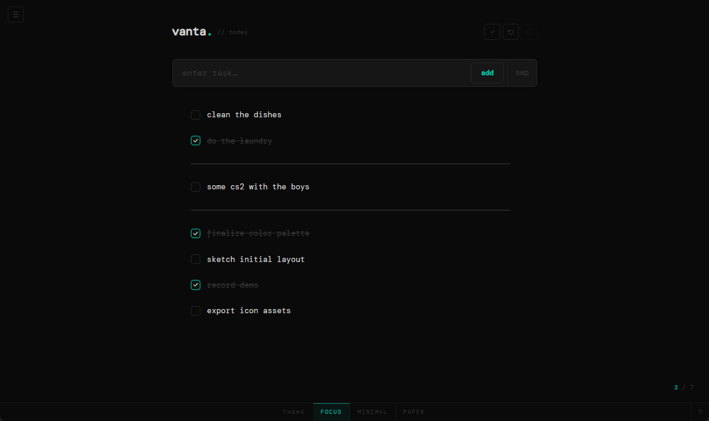

# vanta.

<!-- cover -->


---

A minimal checklist app. Single HTML file, no dependencies, no server — just open it in a browser.

---

## features

- **tasks** — add, check off, edit in-place, delete
- **separators** — visual dividers to group tasks into sections
- **drag to reorder** — grab the handle on any item and drop it where you want
- **undo / redo** — full history via Ctrl+Z / Ctrl+Y
- **profiles** — save named snapshots of your list; switch between them from the sidebar
- **import / export** — back up or restore your list as a `.json` file
- **themes** — three built-in themes: *focus*, *minimal*, *paper*
- **persistent settings** — last-used theme is saved to `localStorage` (or `vanta.settings.json` via the File System Access API)
- **zero dependencies** — one self-contained `.html` file

---

## getting started

```bash
# no install needed — just open the file
open vanta.html
```

Or drop it on any static file server. Works entirely offline.

---

## keyboard shortcuts

| key | action |
|---|---|
| `Enter` | add task |
| `Ctrl+Enter` | add separator |
| `/` | focus task input |
| `Double-click` | edit task text / rename profile |
| `Esc` | cancel edit |
| `Ctrl+Z` | undo |
| `Ctrl+Y` | redo |
| `Ctrl+S` | save to current profile |
| `Ctrl+M` | toggle sidebar |
| drag handle | reorder item |

---

## profiles

Profiles are named snapshots of your task list, stored in `localStorage`.

- **save** — press `+` in the sidebar, or hit `Ctrl+S` at any time
- **open** — click the arrow `›` next to any profile name
- **rename** — double-click a profile name in the sidebar
- **delete** — click the `×` next to a profile
- **export** — downloads a `vanta-checklist.json` file of your current list
- **import** — loads a previously exported `.json` file

---

## themes

Switch themes from the bar at the bottom of the screen.

| name | description |
|---|---|
| `focus` | near-black, teal accent — high contrast for deep work |
| `minimal` | dark grey, white accent — neutral and quiet |
| `paper` | warm cream, slate accent — easy on the eyes |

Theme preference is saved automatically.

---

## file structure

```
vanta.html              — the entire app (HTML + CSS + JS)
icon.png                — favicon
screenshotcover.png     — cover image (used in this README)
```

---

## local storage keys

| key | contents |
|---|---|
| `vanta_settings` | `{ theme: string }` |
| `vanta_profiles` | `{ profiles: Profile[], counter: number }` |

Profiles are stored as plain JSON arrays. Each profile holds a copy of the `items` array at save time.

---

## license

This project is licensed under [Creative Commons Attribution-NonCommercial 4.0 International (CC BY-NC 4.0)](https://creativecommons.org/licenses/by-nc/4.0/).

You are free to use, share, and adapt this software for non-commercial purposes, provided appropriate credit is given. Commercial use is not permitted.

---

## disclaimer

This app is provided as-is, without warranty of any kind. The developer makes no guarantees regarding data integrity, loss, or corruption. You are solely responsible for any data you enter, store, or manage using this application, and for any consequences arising from its use. Use at your own risk.
